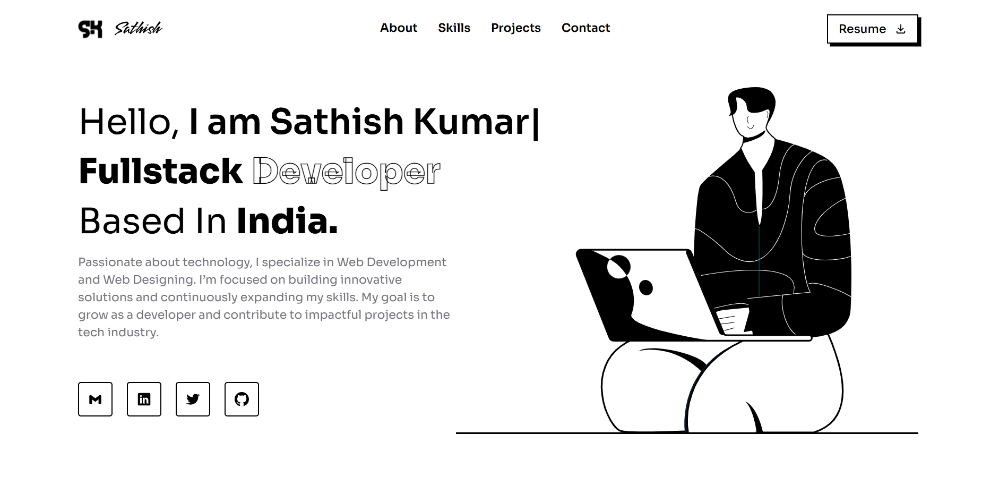

# SK Portfolio - HTML/CSS/JavaScript Version

Esta es una recreación completa en HTML, CSS y JavaScript del portfolio original basado en React. El proyecto mantiene el mismo diseño visual y funcionalidad utilizando únicamente tecnologías web nativas, sin necesidad de frameworks o procesos de build.

## ✨ Vista Previa



## 🚀 Características

- **Diseño Responsivo**: Layout completamente responsivo optimizado para móvil, tablet y desktop
- **Cursor Personalizado**: Cursor interactivo con efectos hover y animaciones fluidas
- **Animaciones Suaves**: Animaciones basadas en CSS3 con Intersection Observer para activación por scroll
- **Efecto Typewriter**: Animación de máquina de escribir implementada en JavaScript vanilla
- **Navegación Móvil**: Menú hamburguesa colapsable con transiciones suaves
- **Formulario de Contacto**: Formulario funcional con validación HTML5 y JavaScript
- **Contenido Dinámico**: Skills, experiencia y proyectos renderizados dinámicamente
- **SEO Optimizado**: Meta tags completos, HTML semántico y structured data
- **Accesibilidad**: Cumple estándares WCAG con soporte para lectores de pantalla
- **Rendimiento**: Optimizado para Core Web Vitals con lazy loading de imágenes

## 📁 Estructura del Proyecto

```
Illustration-portfolio-AI/
├── css/
│   ├── base/
│   │   ├── reset.css          # Reset CSS y normalización
│   │   ├── variables.css      # Propiedades CSS personalizadas
│   │   └── typography.css     # Utilidades de tipografía
│   ├── components/
│   │   ├── buttons.css        # Componentes de botones
│   │   ├── cards.css          # Componentes de tarjetas
│   │   ├── cursor.css         # Estilos del cursor personalizado
│   │   ├── forms.css          # Componentes de formularios
│   │   └── navigation.css     # Componentes de navegación
│   ├── layout/
│   │   ├── footer.css         # Layout del footer
│   │   ├── grid.css           # Sistema de grid y layout
│   │   └── header.css         # Header y navbar
│   ├── sections/
│   │   ├── about.css          # Sección About
│   │   ├── contact.css        # Sección Contact
│   │   ├── hero.css           # Sección Hero
│   │   ├── projects.css       # Sección Projects
│   │   └── skills.css         # Sección Skills
│   ├── utils/
│   │   ├── animations.css     # Utilidades de animación
│   │   └── utilities.css      # Clases utilitarias
│   └── main.css               # Archivo CSS principal con imports
├── js/
│   └── script.js              # Archivo JavaScript principal
├── index.html                 # Archivo HTML principal
└── README.md                  # Documentación del proyecto
```

## 🎨 Sistema de Diseño

### Colores

- **Primario**: `#000000` (Negro)
- **Secundario**: `#ffffff` (Blanco)
- **Texto Atenuado**: `#71717A`
- **Texto Claro**: `#D4D4D8`
- **Fondo Oscuro**: `#000000`
- **Fondo Gris**: `#27272A`

### Tipografía

- **Familia de Fuente**: Sora (Google Fonts)
- **Pesos de Fuente**: 300, 400, 500, 600, 700, 800
- **Tipografía Responsiva**: Escala apropiadamente en móvil y escritorio

## 🛠️ Tecnologías Utilizadas

- **HTML5**: Markup semántico
- **CSS3**: CSS moderno con custom properties, grid, flexbox
- **JavaScript ES6+**: Características modernas de JavaScript
- **Iconos SVG**: Gráficos vectoriales escalables para iconos
- **Google Fonts**: Familia de fuentes Sora

El proyecto incluye todos los assets necesarios en la carpeta `assets/`:

- **logo.svg** - Logo del portfolio
- **hero-vector.svg** - Ilustración principal
- **about-me.svg** - Ilustración de la sección About
- **favicon.png / favicon-dark.png** - Iconos del sitio
- **preview.png** - Imagen de vista previa
- **project1.png** - Imagen de ejemplo de proyecto

## 🌟 Diferencias Clave de la Versión React

- **Sin Proceso de Build**: HTML/CSS/JS puro, no necesita compilación
- **Animaciones CSS**: Reemplaza Framer Motion con animaciones CSS
- **JavaScript Vanilla**: Sin librerías externas de JavaScript
- **Iconos SVG**: SVGs inline en lugar de react-icons
- **Assets Estáticos**: Referencias directas de assets en lugar de imports

## 🎯 Rendimiento

- **Ligero**: Sin frameworks pesados de JavaScript
- **Carga Rápida**: Dependencias mínimas
- **SEO Friendly**: HTML renderable del lado del servidor
- **Accesibilidad**: HTML semántico y etiquetas ARIA apropiadas

## 📝 Personalización

### Agregar Nuevas Skills

Edita el array `skills` en `js/script.js`:

```javascript
const skills = [
  { id: 11, name: "Nueva Skill", icon: "🆕" },
  // ... skills existentes
];
```

### Modificar Colores

Actualiza las propiedades CSS personalizadas en `css/base/variables.css`:

```css
:root {
  --primary-color: #tu-color;
  --secondary-color: #tu-color;
}
```

### Actualizar Información Personal

1. **Nombre y título**: Edita las variables en `js/script.js`
2. **Links sociales**: Actualiza los atributos `href` en `index.html`
3. **Información de contacto**: Modifica email y teléfono en la sección de contacto
4. **Proyectos**: Edita el array `projects` en `js/script.js`

---

**Versión React Original**: Basado en el proyecto illustration-portfolio React  
**Convertido a HTML/CSS/JS**: Recreación nativa  
**Última actualización**: Enero 2025

## 🤝 Contribuciones

Las contribuciones son bienvenidas. Por favor:

1. Fork el proyecto
2. Crea una rama para tu feature (`git checkout -b feature/AmazingFeature`)
3. Commit tus cambios (`git commit -m 'Add some AmazingFeature'`)
4. Push a la rama (`git push origin feature/AmazingFeature`)
5. Abre un Pull Request
